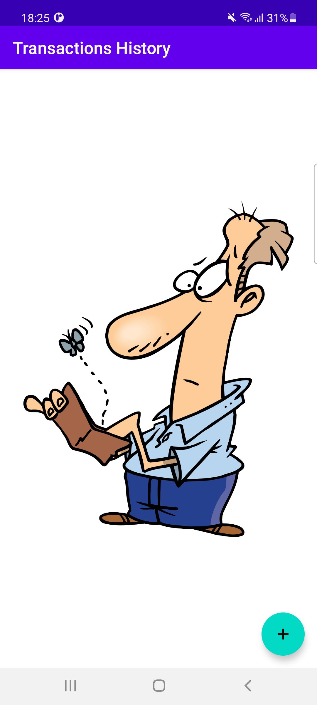
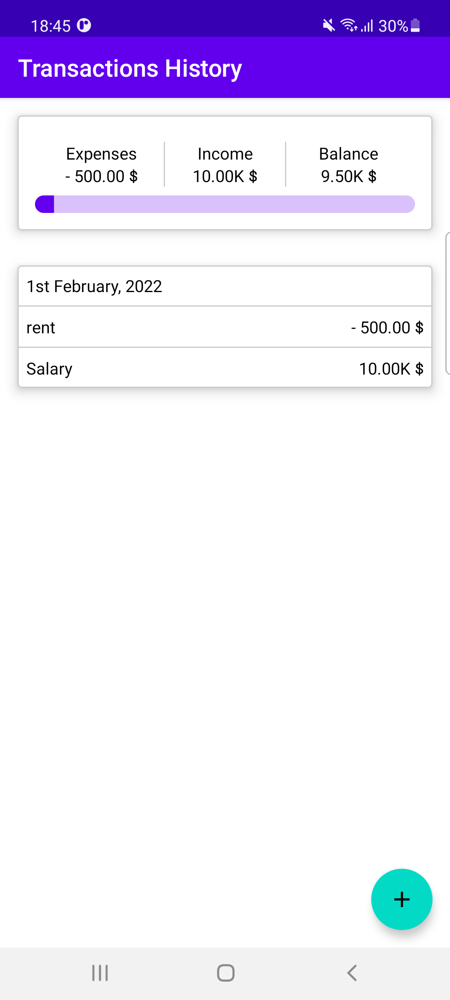
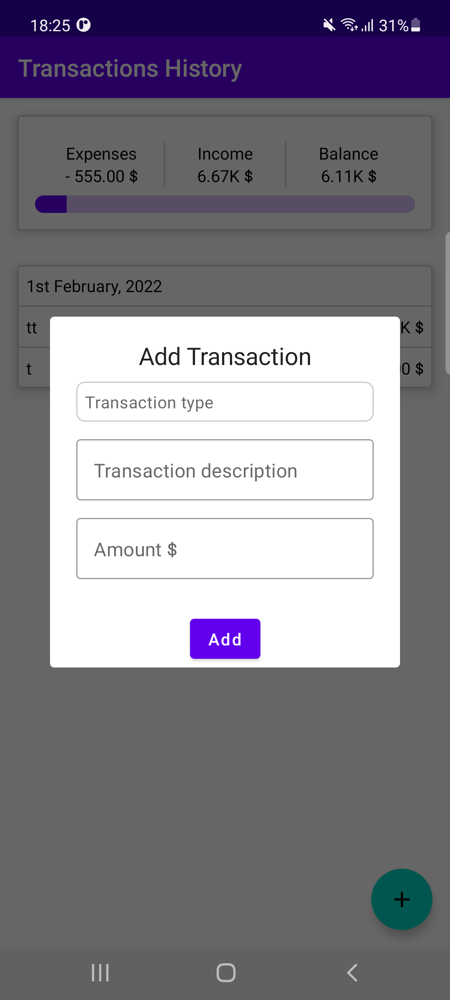

/**
* All copy rights back to Zeinab Abdelmawla
**/

  
Wallet Mobile App
===================================

This application is Money wallet with basic functionality (view / add) Expenses and Incomes categorized by date .

Framework Language:
- Android 
  
Programing Language:
- Kotlin 

Pre-requisites
--------------
- Android SDK 31

App Sample
----------

Screenshots
-------------

Testing
---------------

- For functionality test : covered by unit testing
- For UiTest flow : covered by Instrumentation testing

Dependencies
-------
- 'androidx.core:core-ktx:1.7.0'
- 'androidx.appcompat:appcompat:1.4.1'

- 'com.google.android.material:material:1.5.0'
- 'androidx.constraintlayout:constraintlayout:2.1.3'
- 'androidx.compose.ui:ui-tooling-preview:1.0.5'
- 'androidx.compose.material:material:1.0.5'
- 'androidx.compose.ui:ui-tooling:1.0.5'
- 'androidx.compose.ui:ui:1.2.0-alpha02'
    
- 'androidx.navigation:navigation-ui-ktx:2.4.0'
- 'androidx.navigation:navigation-fragment-ktx:2.4.0'

## DI
- 'com.google.dagger:hilt-android:2.40.4'
- 'com.google.dagger:hilt-compiler:2.38.1'
## Database
- 'androidx.room:room-runtime:2.4.1'
- 'androidx.room:room-compiler:2.4.1'
- 'androidx.room:room-compiler:2.4.1'
- 'androidx.room:room-ktx:2.4.1'

## Testing
- 'junit:junit:4.13.2'
- 'androidx.test.ext:junit:1.1.3'
- 'androidx.test.espresso:espresso-core:3.4.0'
- 'io.mockk:mockk:1.12.2'
- 'org.jetbrains.kotlinx:kotlinx-coroutines-test:1.6.0'
- 'androidx.test:core-ktx:1.4.0'
- 'androidx.test.ext:junit-ktx:1.1.3'
- 'org.jetbrains.kotlinx:kotlinx-coroutines-test:1.6.0'

- 'androidx.compose.ui:ui-test-junit4:1.0.5'
- 'com.google.dagger:hilt-android-testing:2.38.1'
- 'com.google.dagger:hilt-android-compiler:2.38.1'

License
-------

Copyright (c) 2017.  All Code CopyRights reserved For Zeinab Mohamed Abdelmawla
